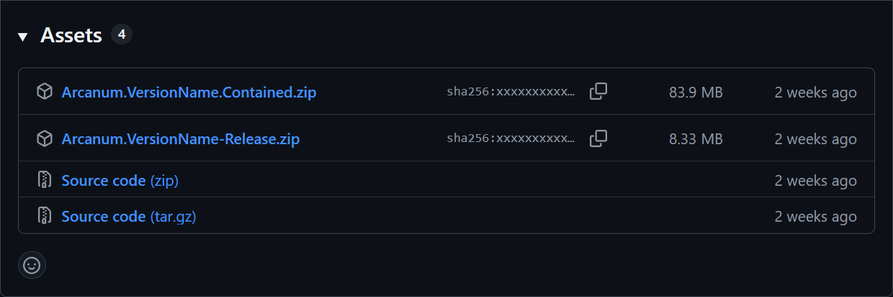

# Installation

<link-summary>
    How to install Arcanum on your system.
</link-summary>

Arcanum can be installed in two ways:

* **Executable (.exe):** The easiest method. Just download and run — no setup required.
* **Source Code:** For developers or advanced users who want to build Arcanum manually.

Arcanum is fully portable, meaning no installer is required. Place the executable file wherever you like and run it
directly.

> Building from source requires basic knowledge of compiling .NET applications. If you just want to use Arcanum, we
> recommend the executable method.
> {style="note"}

<procedure title="Hardware Requirements">
    <step>
        Windows 10 or later (Some community members are trying to make Arcanum run via Proton, but to no success so far)
    </step>
</procedure>

<procedure title="Setup Requirements" id="setup-requirements">
    <step>
        The command <code>script_docs</code> was run in the <a href="https://eu5.paradoxwikis.com/Console_commands">EU5 console</a>.
    </step>
    <warning>It is important to run the <code>script_docs</code> command for Arcanum to work!</warning>
</procedure>

<tabs>
    <tab id="executable-install" title="Executable">
        <procedure title="Installation Using an Executable" id="executable-id">
            <step>
            Go to the <a href="https://github.com/The-Arcanum-Project/Arcanum/releases">Releases tab</a> and go to the Assets of the latest Release.
            
            </step>
            <step>
            <a href="Install.md#choose-version">Choose</a> the desired version of the <b>Arcanum executable</b>. <a href="Install.md#choose-version">(See below for details!)</a>
            </step>
            <step>
            Download the selected <code>Arcanum.zip</code> version and extract the exectuable file (<b>.exe</b>) from it.
            </step>
            <step>
            Place the executable in any folder of your choice (for example, <code>C:\Tools\Arcanum\</code>).
            </step>
            <step>
            Double-click <code>Arcanum.exe</code> to launch.
            </step>
        </procedure>
        <procedure id="choose-version" title="Choosing Release or Contained Versions">
            
There are two types of executable releases available:

            <step>
                <b>Release Version:</b> This is the standard version that requires the .NET runtime to be installed
                on your system and is therefor smaller in size. Choose this if you already have the .NET runtime installed.
            </step>
            <step>
                <b>Contained Version:</b> This version includes the .NET runtime bundled with it. It is larger in size
                but does not require any additional installations. Choose this if you prefer a self-contained setup.
            </step>
            <note>
                If you are unsure, the <b>Contained Version</b> is recommended for most users, as it does not necessitate
                any additional installations.
            </note>
        </procedure>
    </tab>
    <tab id="code-install" title="Source Code">
        This option is for those who want to build the project themselves.
        <procedure title="Prerequisites">
            
<a href="https://dotnet.microsoft.com/download">.NET SDK (.NET 8.0)</a>

            
<a href="https://git-scm.com/downloads">Git</a>

        </procedure>
        <procedure title="Installation from Source">
            <step>
            <b>Clone the Repository:</b> Open a terminal/command prompt and run:
                <code-block language="bash">
                    git clone https://github.com/The-Arcanum-Project/Arcanum.git
                    cd Arcanum
                </code-block>
            </step>
            <step>
                <b>Build the Project:</b> Compile in <b>Release mode</b>:
                <code-block language="bash">
                dotnet build -c Release
                </code-block>
            </step>
            <step>
                <b>Locate the Executable:</b> After a successful build, the compiled executable will be in:
                <code language="bash">
                    ./bin/Release/net8.0/Arcanum.exe
                </code>
                <note>The exact folder may vary depending on your .NET version.</note>
            </step>
            <step>
                <b>Run Arcanum:</b> Execute the program with::
                <code-block language="bash">
                    ./bin/Release/net8.0/Arcanum.exe
                </code-block>
            </step>
        </procedure>
   </tab>
</tabs>